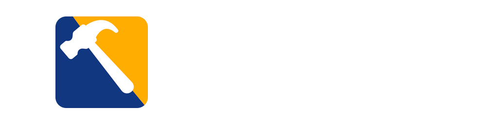

    

    
    

# A bunch of tools for Counter-Strike 2 Workshop:
### Loading Editor:
With this tool, you can add images, descriptions, and icons to the loading screen.

### SoundEvent Editor:
A tool for more comfortable sound editing within the game.

### Hotkey Editor:
Edit default keyboard shortcuts and add your own!

### BatchCreator:
Allows you to edit multiple files with the same parameters at one time. For example, if you have a modular set with 15 models, it is tedious to use the default Model/Material Editor, but with BatchCreator, you can do it all with one click.

### SmartProp Editor:
A tool that helps with smartprops creation in the game.

| Tool | Status |
| ------ | ------ |
| Loading Editor | Done |
| SoundEvent Editor | Done |
| Hotkey Editor | planned |
| BatchCreator | Done |
| SmartProp Editor | In process |
| Sync Editor | planned |
